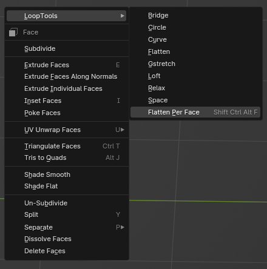

# Blender Addons

# Multi Importer

## Description
**Multi Importer** is a Blender add-on designed for convenient import of models from files with various extensions and from archives. This tool simplifies the workflow by allowing you to import multiple file formats directly from the Blender interface.

## Features
- Supports multiple file formats: FBX, OBJ, STL, ABC, USD, USDZ, BLEND, ZIP, DAE.
- Automatically detects and imports files from ZIP archives.
- Imports textures in common image formats (PNG, JPG, JPEG, TGA, BMP).
- Seamlessly integrates into the Blender interface under `File > Import`.
- Assigns a shortcut (`Ctrl + Shift + Alt + I`) for quick access.

## Usage
1. **Import Models**:
   - Go to `File > Import > Import Multi Format`.
   - Alternatively, use the shortcut `Ctrl + Shift + Alt + I` to open the import dialog.
2. **Select the File**:
   - Choose the file you want to import. The add-on will automatically detect the file format and use the appropriate import function.
3. **Import from ZIP Archives**:
   - If you select a ZIP file, the add-on will extract its contents to a temporary directory and import all recognized files.
4. **Import Textures**:
   - The add-on also supports importing textures in common image formats. These textures will be packed into the .blend file.

## Installation
1. Download the `multi_importer.py` script from this repository.
2. In Blender, go to `Edit > Preferences > Add-ons`.
3. Click `Install...`, navigate to the downloaded script, and install it.
4. Enable the add-on by checking the box next to `Multi Importer`.

# Keep File Clean

## Description
**Keep File Clean** is a Blender add-on that automatically cleans up unused data blocks when you save your Blender project. This helps to prevent the file size from growing unnecessarily due to orphaned data blocks, ensuring that your .blend files remain as small and efficient as possible.

## Why Use Keep File Clean?
Over time, as you add and remove objects, materials, and other data blocks, your Blender project file can accumulate unused data. This can lead to larger file sizes and potentially slower performance. **Keep File Clean** ensures that these orphaned data blocks are removed every time you save, keeping your project file optimized and efficient.

## Features
- Automatically cleans up unused data blocks on file save.
- Provides a popup report indicating how many data blocks were cleaned.

## Usage
Once installed and enabled, the add-on works automatically. Every time you save your Blender project, it will clean up any unused data blocks and provide a report on how many blocks were cleaned.

## Installation
1. Download the `keep_file_clean.py` script from this repository.
2. In Blender, go to `Edit > Preferences > Add-ons`.
3. Click `Install...`, navigate to the downloaded script, and install it.
4. Enable the add-on by checking the box next to `Keep File Clean`.

# Flatten Per Face

## Description
**Flatten Per Face** is a Blender add-on that sequentially flattens selected faces in Edit Mode. This tool is particularly useful after retopology, where quadrilateral faces might not lie on a single plane, potentially degrading the visual quality of the model. The add-on leverages the [LoopTools](https://extensions.blender.org/add-ons/looptools/) add-on to achieve the desired flattening effect.

## Use Case
After retopology, your model might contain quadrilateral faces with vertices that do not lie on the same plane. This can lead to rendering artifacts and degrade the visual quality of the model. The **Flatten Per Face** add-on addresses this issue by flattening each selected face, ensuring that all vertices of a face lie on a single plane. If the result is not perfect after the first run, you can run the add-on multiple times until the faces are perfectly flattened.

## Features
- Flattens each selected face independently.
- Can be used multiple times to achieve the perfect result.
- Seamlessly integrates into the Blender interface.

## Usage

1. **Select Faces**: In Edit Mode, select the faces you want to flatten.
2. **Run the Add-on**:
   - Right-click to open the context menu.
   - Navigate to `LoopTools` and select `Flatten Per Face`.
   - Alternatively, use the shortcut `Ctrl + Shift + Alt + F` to run the add-on.
3. **Review and Repeat**: Check the result and, if necessary, repeat the process to achieve the desired flatness.

## Installation
1. Ensure you have the [LoopTools](https://extensions.blender.org/add-ons/looptools/) add-on installed and activated in Blender.
2. Download the `flatten-per-face.py` script from this repository.
3. In Blender, go to `Edit > Preferences > Add-ons`.
4. Click `Install...`, navigate to the downloaded script, and install it.
5. Enable the add-on by checking the box next to `Flatten Per Face`.

# Export Selected to FBX

## Description
**Export Selected to FBX** is a Blender add-on that allows you to quickly export selected objects to an FBX file in the same directory as the .blend file. This tool is particularly useful for exporting models to Unreal Engine, streamlining the workflow by providing a convenient shortcut.

## Features
- Exports selected objects to FBX with a single shortcut (`Ctrl + Shift + Alt + S`).
- Saves the exported FBX file in the same directory as the .blend file.
- Automatically names the FBX file after the selected object or the .blend file if multiple objects are selected.

## Usage
1. **Select Objects**: In Object Mode, select the objects you want to export.
2. **Export to FBX**:
   - Use the shortcut `Ctrl + Shift + Alt + S` to quickly export the selected objects to FBX.
   - Alternatively, go to `File > Export > Export Selected to FBX`.

### Example Workflow
1. **Preparing for Export**:
   - Make sure your .blend file is saved.
   - Select the objects in Object Mode that you want to export.
2. **Export Process**:
   - Use the shortcut or menu option to export.
   - The add-on will automatically name the FBX file based on the selected object or .blend file and save it in the same directory.

## Installation
1. Download the `export_selected_to_fbx.py` script from this repository.
2. In Blender, go to `Edit > Preferences > Add-ons`.
3. Click `Install...`, navigate to the downloaded script, and install it.
4. Enable the add-on by checking the box next to `Export Selected to FBX`.